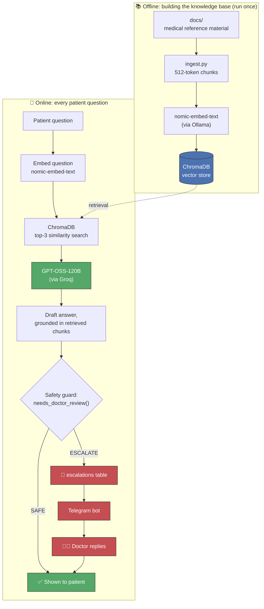
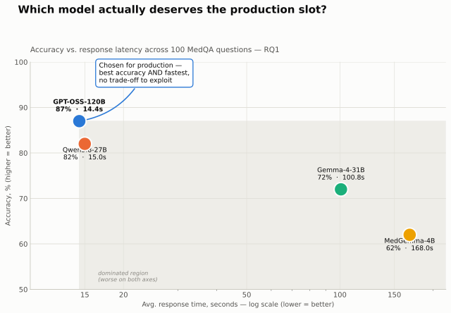
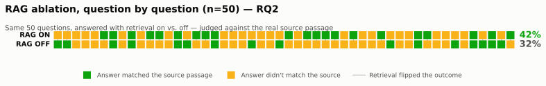
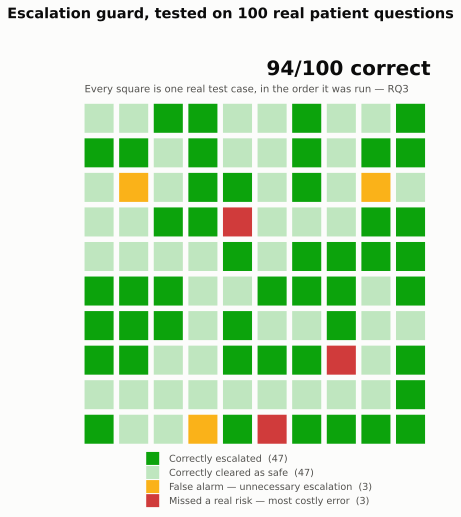

# 🏥 CARA: Complexity-Aware, memory-grounded Agentic RAG


CARA is a multi-tenant medical chatbot platform I built for my master's thesis
in Data Science at Università Federico II di Napoli (expected graduation
October 2026). Clinics and hospitals onboard their patients, patients chat
with an AI assistant about their health, and the core idea of my thesis is
that CARA knows when a question is too complex or too risky to answer alone,
so it hands it off to a real doctor instead of guessing.

Every claim below is backed by a script in this repo that you can re-run
yourself. See [Reproducing the evaluations](#reproducing-the-evaluations) for
how.

🔗 **[Explore the interactive results dashboard →](https://claude.ai/artifact/1SqApXYKy3bcbRssNozCtt)**.
It has the same three charts you'll see below, but you can hover any point or
cell to see the real case behind it.

### Key results at a glance

| Research question | What was measured | Result |
|---|---|---|
| **RQ1**: model routing | Accuracy & latency of 4 candidate LLMs on 100 MedQA questions | GPT-OSS-120B **dominates on both axes**, no trade-off left to route on |
| **RQ2**: does RAG help | 50 questions answered with retrieval on vs. off, checked against the real source | **42%** consistent with RAG vs **32%** without |
| **RQ3**: escalation guard | 100 real patient/question pairs, precision & recall of the safety reviewer | **94%** accuracy, precision, recall, and F1 |

## Table of contents

- [What CARA actually does](#what-cara-actually-does)
- [The complexity-aware escalation loop](#the-complexity-aware-escalation-loop)
- [Multi-tenant architecture](#multi-tenant-architecture)
- [How it works](#how-it-works)
- [Research questions & results](#research-questions--results)
- [Demo / test data](#demo--test-data)
- [Project structure](#project-structure)
- [Setup](#setup)
- [Running it](#running-it)
- [Reproducing the evaluations](#reproducing-the-evaluations)
- [License](#license)

## What CARA actually does

- **Patients** register under their clinic (using a Clinic ID their clinic gives
  them), then chat with CARA about symptoms, medications, or general health
  questions. CARA answers using a RAG pipeline over curated medical reference
  material, always taking the patient's own conditions, medications, and
  allergies into account, and rewrites its own technical answer into a warm,
  plain-language explanation before showing it.
- Patients can attach a **photo** (analyzed with Gemini vision) or a **PDF**
  document, or just **speak their question** (transcribed with Whisper via Groq).
- **Clinics / hospitals** get a dashboard to add patients one at a time or in
  bulk (CSV/TSV/XLSX import, with a downloadable template), edit or deactivate
  patient records, search their patient list, export it to CSV, and review a
  queue of questions that CARA has flagged for a doctor's judgment.

## The complexity-aware escalation loop

This is the central mechanism of my thesis. Every answer CARA drafts passes
through a **safety reviewer** prompt (`needs_doctor_review` in `app.py`) that
judges the *question* itself, not just whether the drafted answer sounds
confident and well-written. I made it escalate whenever, for example:

- the patient is on two or more medications and asks about a new drug, symptom,
  or dosage/timing change,
- the question touches a possible drug–drug, drug–condition, or drug–allergy
  interaction,
- the described symptom could indicate an emergency,
- the patient has a serious chronic condition relevant to the question.

When a question is escalated:

1. It's written to the `escalations` table with CARA's draft answer and the
   reviewer's reason.
2. `telegram_bot.py` runs as a small, always-on background process,
   independent of the Streamlit app. It polls for pending escalations and
   sends each one to the doctor's Telegram as a message, with the patient's
   relevant history, medications, and allergies attached.
3. The doctor **replies directly to that Telegram message**. The bot picks up
   the reply, rewrites it in patient-friendly language, and writes it back to
   the database.
4. The patient sees the doctor's reply appear automatically the next time they
   open that conversation, no polling or extra click needed.

Doctors can also resolve a pending question straight from the clinic dashboard's
**Escalations** tab if they'd rather not use Telegram.

## Multi-tenant architecture

I backed everything with a single SQLite database (`backend/cara.db`), managed
entirely through `backend/database.py`. Clinics and patients live in separate
tables; a patient's email is globally unique across the whole platform, and
every patient row is scoped to exactly one clinic (`clinic_id`), so one
clinic's dashboard, patient list, and escalation queue never leak into
another's.

New patients can join a clinic two ways:
- **Self-registration**: the patient enters the Clinic ID their clinic gave
  them, their name, email, and a password.
- **Clinic-added "shell" accounts**: a clinic pre-loads a patient (manually or
  via bulk import) with their medical history but no password yet. The patient
  later "claims" that exact record by registering with the same email. This
  avoids ever creating duplicate patients when a clinic imports someone who
  later signs up themselves.

## How it works



This is a change from my original proposal's 3-tier model router. I replaced
it with a single production model (see [RQ1, below](#research-questions--results)
for why), while keeping the rest of the pipeline exactly as designed:
retrieval, grounding, and the escalation safety net.

## Research questions & results

### RQ1: which model actually deserves the production slot

My original proposal called for **complexity-based routing** across three
model tiers: a small, medium, and large model, picked per-question by a
lightweight classifier. Before building that, I benchmarked four realistic
open-weight candidates head-to-head on **100 MedQA questions**
(`backend/evaluate.py` runs the benchmark, `backend/analyze_results.py` builds
the comparison, and the raw results are in `eval_results/`):



**Finding:** GPT-OSS-120B isn't a trade-off pick. It wins on accuracy *and*
latency at the same time. A router only earns its complexity if there's a
cost/accuracy trade-off to exploit between tiers, and here there isn't one, so
I replaced the tiered-routing layer from my proposal with this single,
empirically-justified model choice. That substitution, backed by the evidence
above, is my direct answer to RQ1, not a shortcut around it.

### RQ2: does retrieval (RAG) actually help

I generated 50 test questions automatically from real chunks in the RAG
knowledge base, using a fixed random seed, one question per chunk, written by
the LLM itself so that answering it correctly requires that exact passage (see
`build_rag_ablation_testset.py`). I then answered each question twice, once
with retrieval on and once with it forced off, and had an LLM judge check each
answer against the real source passage, blind to which condition produced it.



**Finding:** retrieval measurably helps: 42% consistent with the source vs.
32% without, even on this deliberately hard, citation-level test set that's
designed to stress-test grounding rather than reflect typical patient
questions. What matters more than the average, though, is the per-question
view above. Retrieval doesn't win uniformly: it flips some questions in CARA's
favor and a few against it, which is itself useful evidence about where a
large pretrained model's own knowledge competes with retrieval.

### RQ3: how reliable is the escalation guard

I built 100 test cases from real patient records across all three demo
clinics (`build_escalation_testset.py`), using six explicit, rule-based
categories that mirror the exact criteria in the guard's own prompt, so every
label follows mechanically from real medication counts, conditions, and
allergies instead of being hand-picked.



**Finding:** 94% accuracy, precision, recall, and F1. The 3 missed-risk cases
(false negatives) are the ones worth studying further, and I've saved them in
full, per-case detail in `escalation_eval_results/escalation_eval_raw.json`.

*(RQ4, whether human-in-the-loop approval increases trust without adding
friction, is a user-study question I haven't tried to answer quantitatively in
this repo. The approval mechanism itself is built and working, and I describe
it above.)*

## Demo / test data

To test the platform (and the escalation logic in particular) against
realistic, messy medical histories rather than only clean hand-written
examples, I populated two demo clinics with **de-identified synthetic patient
records** from the [Synthea](https://synthetichealth.github.io/synthea/)
dataset (112,411 patients, sourced via HuggingFace; see `DATA.md` for the exact
source, download links, and selection method):

- **Ciro Clinic**: 200 patients, reproducibly sampled with a fixed random seed.
- **Riverside General Hospital**: 200 more patients from a different random
  seed, so the two clinics have genuinely non-overlapping populations (the
  point of testing multi-tenant isolation), plus one hand-picked high-risk
  case: Jame Kuhlman, with 18 real conditions and 17 medications including
  warfarin, which I used to stress-test the escalation guard against realistic
  drug-interaction questions.

A third demo clinic, **Bright Smile Dental Care**, adds 8 hand-crafted
dentistry-specific patients (`backend/scripts/import_dental_patients.py`),
because the Synthea data has no dental-specific conditions. I deliberately
designed several of these profiles to probe the escalation logic on real
dental-safety scenarios: a patient on warfarin needing an extraction, a
penicillin allergy alongside a dental abscess, a bisphosphonate raising
jaw-bone risk before an implant, and so on.

## Project structure

```
Thesis/
├── backend/
│   ├── app.py                      # The Streamlit app: patient & clinic experience
│   ├── database.py                 # All SQLite access: schema, auth, patients, escalations
│   ├── telegram_bot.py             # Background process: delivers/resolves escalations via Telegram
│   ├── evaluate.py                 # RQ1: MedQA benchmark runner across candidate LLMs
│   ├── analyze_results.py          # RQ1: builds the comparison table/chart from evaluate.py's output
│   └── scripts/
│       ├── ingest.py                       # Builds the ChromaDB knowledge base (run from project root)
│       ├── build_escalation_testset.py     # RQ3: builds the 100-case labeled test set
│       ├── evaluate_escalation_guard.py    # RQ3: runs the guard, reports precision/recall/F1
│       ├── build_rag_ablation_testset.py   # RQ2: builds the 50-question RAG on/off test set
│       ├── evaluate_rag_ablation.py        # RQ2: runs both conditions, judges against the source
│       └── ...                             # one-time demo-data import & diagnostic scripts
├── eval_results/                   # RQ1: raw + summarized model benchmark results
├── escalation_eval_results/        # RQ3: raw results, summary, and markdown table
├── rag_ablation_results/           # RQ2: raw results, summary, and markdown table
├── assets/                         # chart images used in this README
├── archive/                        # old snapshots & one-time patch scripts, kept for history
├── docs/                           # medical reference material used by the RAG pipeline (gitignored)
├── Patient Dataset/                 # raw Synthea parquet files (gitignored, see DATA.md)
├── DATA.md                          # Where the demo patient data comes from and how it was selected
├── requirements.txt
└── README.md
```

## Setup

1. **Clone the repo and install Python dependencies:**
   ```bash
   pip install -r requirements.txt
   ```
2. **Install [Ollama](https://ollama.com/) locally and pull the embedding model**
   used for the RAG knowledge base:
   ```bash
   ollama pull nomic-embed-text
   ```
3. **Create a `.env` file** in the project root with:
   ```
   GROQ_API_KEY=...
   GEMINI_API_KEY=...
   TELEGRAM_BOT_TOKEN=...
   DOCTOR_CHAT_ID=...
   ```
4. **Build the knowledge base** (only needed once, or again after adding new
   reference documents to `docs/`). Run this from the **project root**:
   ```bash
   python backend/scripts/ingest.py
   ```

## Running it

CARA needs two processes running side by side:

```bash
# Terminal 1: the patient/clinic app
streamlit run backend/app.py

# Terminal 2: delivers escalated questions to the doctor's Telegram
python backend/telegram_bot.py
```

## Reproducing the evaluations

Every number in [Research questions & results](#research-questions--results)
comes from a script here, run in this order, from the project root:

```bash
# RQ3: escalation guard
python backend/scripts/build_escalation_testset.py
python backend/scripts/evaluate_escalation_guard.py

# RQ2: RAG ablation
python backend/scripts/build_rag_ablation_testset.py
python backend/scripts/evaluate_rag_ablation.py
```

Both `evaluate_*` scripts make real Groq API calls, so they need internet and
take a few minutes. They're safe to interrupt and resume: progress is saved
after every single test case.

## Author

**Farshad Farahtaj**, MSc Data Science, Università Federico II di Napoli
(expected graduation October 2026)

- GitHub: [github.com/Farshad-Farahtaj](https://github.com/Farshad-Farahtaj)
- LinkedIn: [linkedin.com/in/farshad-farahtaj-917118258](https://www.linkedin.com/in/farshad-farahtaj-917118258/)
- Email: farshad.farahtaj7@gmail.com

## License

MIT. See [LICENSE](LICENSE) for details.
